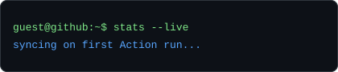

<h1 align="center">Debarghya Das</h1>

AI • ML • Data Science • Research Enthusiast   B.Tech in Computer Science & Technology @IIEST Shibpur (2024–2028)

<table>
<tr>
<td width="50%">

</td>
<td width="50%" valign="top">

  

**Research Intern, ISI Kolkata** — LLM fine-tuning, RAG pipelines, deep learning, LangGraph

**Data Analyst Intern, Bluestock Fintech** — Power BI, PostgreSQL, DAX

`Python` • `C` • `C++` • `SQL` • `Scikit-learn` • `LightGBM` • `XGBoost` • `CatBoost` • `LangChain` • `LangGraph` • `ChromaDB` • `Pandas` • `NumPy` • `Matplotlib` `Google Earth Engine` • `Git` • `GitHub`

📫 rik.deb1508@gmail.com

📫 www.linkedin.com/in/debarghya-das-297961315

</td>
</tr>
</table>

---

Both graphics on this page are drawn by this repository, not fetched from a third-party badge service — `ascii.svg` is a photo run through a character ramp by `scripts/make_portrait.py`, and `stats.svg` is pulled fresh from the GitHub GraphQL API once a day by a scheduled Action in `.github/workflows/update.yml` and only committed when something changed. Both animate with native SVG SMIL (`<animate>`), since GitHub strips `<script>` and `<style>`-heavy CSS from README-embedded SVGs but leaves SMIL alone. Because nothing loads from an external server, nothing here can rate-limit or go dark.

Portrait regenerated with: `python3 scripts/make_portrait.py your-photo.jpg assets/ascii.svg`
